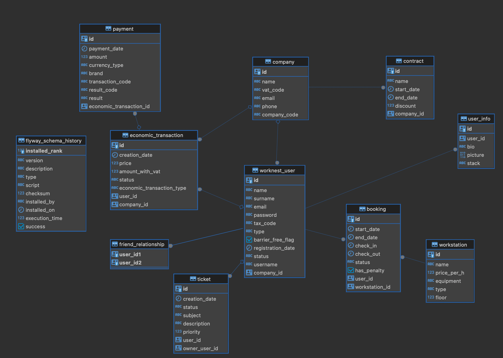

# Database Schema Documentation for Worknest

## Overview

This document provides an overview of the Worknest database schema, outlining the design decisions, the structure of each table, and the relationships between them. Flyway is used for database version control and to apply migrations.

## Schema Design

The Worknest database is designed to store information about companies, users, workstations, bookings, economic transactions, and support tickets. Below is a description of each table and its purpose:

### `company`
Stores details about companies that are associated with various users and economic transactions.

- `id`: Unique identifier (UUID) for the company.
- `name`: Name of the company.
- `vat_code`: VAT registration number.
- `email`: Contact email address.
- `phone`: Contact phone number.
- `company_code`: Custom code for the company.

### `worknest_user`
Holds information about users who can book workstations, conduct economic transactions, and interact within the Worknest environment.

- `id`: Unique identifier (UUID) for the user.
- `name`: User's first name.
- `surname`: User's last name.
- `email`: User's email address.
- `password`: Hashed password for account security.
- `tax_code`: Tax identification number.
- `type`: User type (Private, Employee, Business or Administrator).
- `barrier_free_flag`: Accessibility flag.
- `registration_date`: Timestamp of user registration.
- `status`: Account status (active, inactive).
- `username`: Unique username.
- `company_id`: Reference to the user's associated company.

### `user_info`
Contains additional information about users.

- `id`: Unique identifier (UUID) for user info.
- `user_id`: Reference to the user.
- `bio`: Short biography.
- `picture`: Profile picture stored as binary data.
- `stack`: Technical stack or skills.

### `workstation`
Details of workstations that users can book.

- `id`: Unique identifier (UUID) for the workstation.
- `name`: Workstation name.
- `price_per_h`: Cost of booking the workstation per hour.
- `equipment`: Description of equipment provided.
- `type`: Type of workstation.
- `floor`: Floor number where the workstation is located.

### `booking`
Tracks booking records for workstations by users.

- `id`: Unique identifier (UUID) for the booking.
- `start_date`: Start date and time of booking.
- `end_date`: End date and time of booking.
- `check_in`: Actual check-in time.
- `check_out`: Actual check-out time.
- `status`: Booking status (e.g., confirmed, completed).
- `has_penalty`: Indicates if there was a penalty.
- `user_id`: Reference to the user who made the booking.
- `workstation_id`: Reference to the booked workstation.

### `economic_transaction`
Records financial transactions, such as booking payments.

- `id`: Unique identifier (UUID) for the transaction.
- `creation_date`: Date and time the transaction was created.
- `price`: Net price.
- `amount_with_vat`: Gross price including VAT.
- `status`: Transaction status.
- `economic_transaction_type`: Type of transaction.
- `user_id`: Reference to the user involved in the transaction.
- `company_id`: Reference to the associated company.

### `payment`
Stores payment details for economic transactions.

- `id`: Unique identifier (UUID) for the payment.
- `payment_date`: Date and time of payment.
- `amount`: Amount paid.
- `currency_type`: Type of currency used.
- `brand`: Payment brand or method.
- `transaction_code`: Identifier for the transaction.
- `result_code`: Code indicating the payment result.
- `result`: Description of the payment result.
- `economic_transaction_id`: Reference to the related economic transaction.

### `contract`
Defines contracts between companies and the Worknest service.

- `id`: Unique identifier (UUID) for the contract.
- `name`: Contract name.
- `start_date`: Effective start date of the contract.
- `end_date`: End date of the contract.
- `discount`: Any discount applied.
- `company_id`: Reference to the company involved.

### `friend_relationship`
Captures friend relationships between users.

- `user_id1`: Reference to the first user.
- `user_id2`: Reference to the second user.

### `ticket`
Used for managing support tickets submitted by users.

- `id`: Unique identifier (UUID) for the ticket.
- `creation_date`: Timestamp of ticket creation.
- `status`: Current status of the ticket.
- `subject`: Subject or title of the ticket.
- `description`: Detailed description.
- `priority`: Priority level of the ticket.
- `user_id`: Reference to the reporting user.
- `owner_user_id`: Reference to the user owning the ticket resolution.

## Design Decisions

- **UUIDs for IDs**: The use of UUIDs as primary keys
 ensures global uniqueness, which is beneficial for distributed systems and merging databases.
- **Normalization**: The schema is normalized to reduce redundancy and improve data integrity. This is evident in the separation of user information into the `worknest_user` and `user_info` tables.
- **Foreign Key Constraints**: Integrity constraints are enforced to maintain the relationships between tables.
- **Flexible User Roles**: The `type` column in the `worknest_user` table allows for flexible user role management.

## Maintenance Instructions

- **Flyway Migrations**: All schema changes should be managed through Flyway migrations. Each change should be a new migration script with a version higher than the last.
- **Backups**: Regular backups of the database are recommended. Implement automated backups according to the data recovery requirements.

