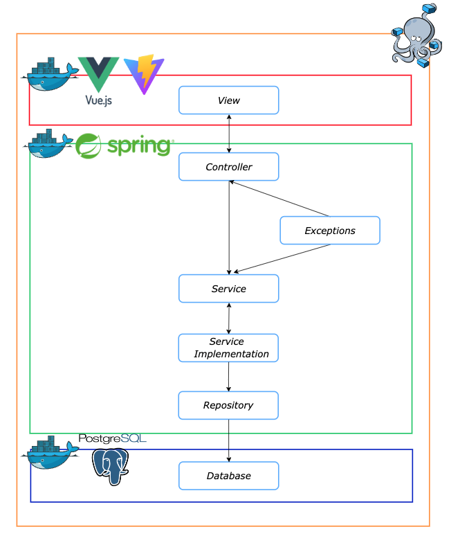

# WorkNest-Overview

Undergraduate project of the course [Design Lab](https://elearning.unimib.it/course/info.php?id=51444) (MSc in Computer Science at [University of Study in Milan-Bicocca](https://en.unimib.it/)).

**WorkNest** is a web application designed to facilitate the booking of desks and meeting rooms within a co-working space by end users and companies. The application allows users to browse available workspaces, make bookings, manage their reservations, and create communities. Companies have access to a dedicated section for managing employees and their bookings. WorkNest also includes an administration section for managing user data, bookings, and agreements with other companies. The application is built using `Vue.js` for the frontend, `Java` with `Spring` framework for the backend, and `PostgreSQL` for the database.
To streamline the development and deployment process, we utilize Docker with Docker Compose. This setup allows us to containerize the frontend, backend, and database components, ensuring that each part of the application can be easily set up, scaled, and maintained across different environments. Docker Compose simplifies the management of these containers by allowing us to define and run multi-container.

# Table of contents

- [WorkNest](#worknest-overview)
  -  [Technologies Used](#technologies-used)
  -  [Architectural Approach](#architectural-approach)
- [Contributors](#contributors)
- [License](#license)

# Technologies Used
### Frontend: 
**Vue.js** as frontend framework, **npm** as packet manager for Javascript, **CSS** and **Vuetify** for the styling of frontend components

### Backend:
**Java/Spring** as backend framework, **Maven** as an automation tool for the Java projects and dependencies management.

### Database:
**PostgreSQL** as Database and **Flyway** as database migration tool manager

### Containerization and Orchestration:
**Docker** and **Docker-compose** to effectively manage create and manage containers

# Architectural Approach
- **Multi-Tier Architecture**: The application architecture follows a multi-tier approach to separate concerns and improve maintainability.
    - **Frontend (View Tier)**: The user interface of the application is built using Vue.js. This tier is responsible for presenting the data to the user and handling user interactions.
    - **Backend (Application Tier)**: The business logic and application functionality are handled by the Java/Spring backend. This tier processes user requests, performs business operations, and communicates with the database.
    - **Database (Data Tier)**: PostgreSQL is used as the database management system to store and manage application data. This tier ensures data integrity, storage, and retrieval.

## Contributors

  - [Riccardo Andena](mailto:r.andena@campus.unimib.it)
  - [Fabio Marini](mailto:f.marini14@campus.unimib.it)
  - [Federico Salvo](mailto:f.salvo2@campus.unimib.it)

## License

This project is licensed under the [MIT License](LICENSE) - see the [LICENSE](LICENSE) file for details.
